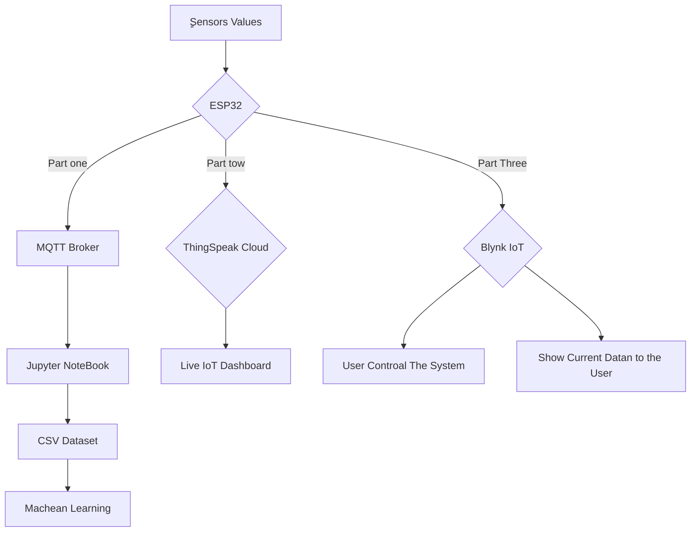
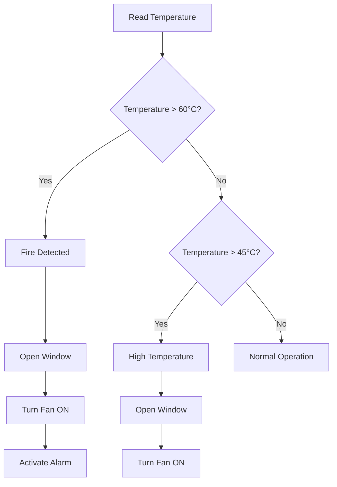
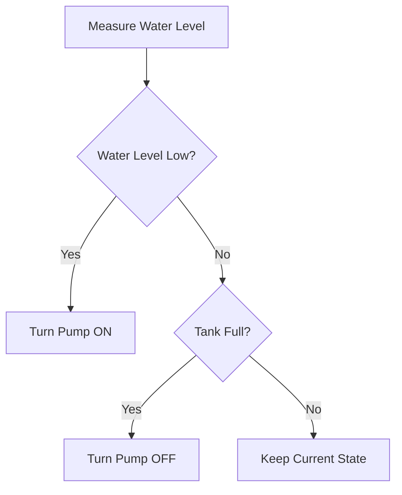
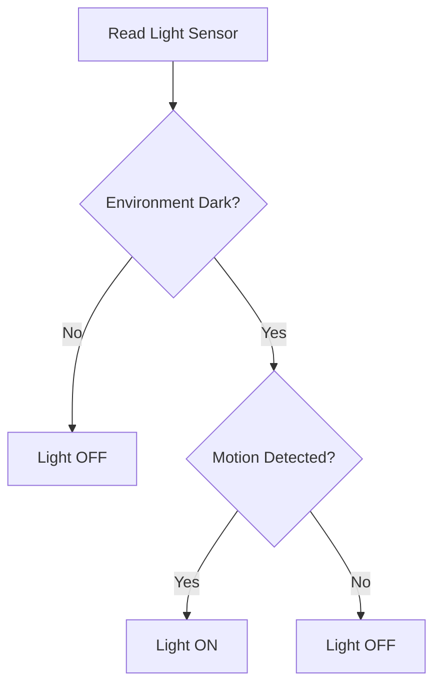
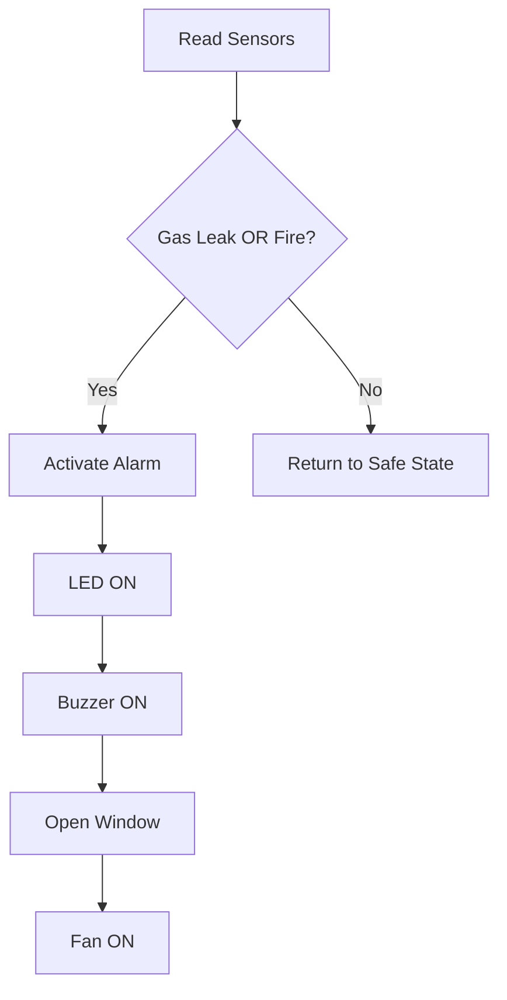
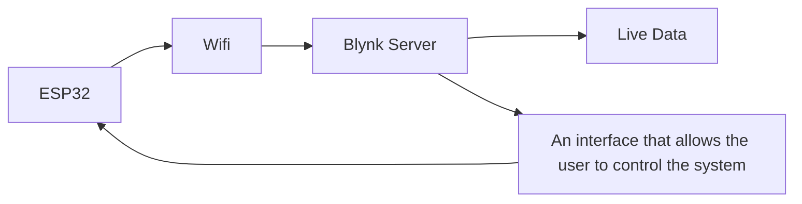
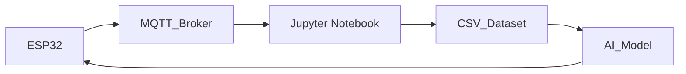

# 🏠 AI Smart Home
### *An End-to-End IoT & Artificial Intelligence Smart Home System*

An intelligent Smart Home platform that combines **ESP32**, **IoT**, **Cloud Computing**, **MQTT**, **Machine Learning**, and **Real-Time Dashboards** into one integrated system capable of monitoring, automation, remote control, and AI-driven analytics.


</p>

---

# 📖 Table of Contents

- Project Overview
- Key Features
- System Architecture
- Data Flow
- Hardware Components
- Software Stack
- Folder Structure
- Code Architecture
- Automation Logic
- Cloud Communication
- AI Pipeline
- Installation
- Usage
- Screenshots
- Future Improvements
- Author

---

# 🚀 Project Overview

AI Smart Home is a complete Internet of Things (IoT) platform that monitors environmental conditions inside a smart house while providing both automatic and manual control over connected devices.

The ESP32 simultaneously communicates with three independent platforms, each serving a different purpose:

- 📱 **Blynk IoT** – Real-time manual control and device monitoring.
- ☁️ **ThingSpeak** – Cloud-based visualization through live sensor charts.
- 📡 **MQTT** – Streaming sensor data directly to a Python environment for dataset generation and AI analysis.

Each communication channel operates independently while receiving the same sensor data directly from the ESP32.

Unlike traditional smart home projects, this system is designed not only for monitoring but also for creating a structured AI-ready dataset capable of supporting predictive analytics.

---

# ⭐ Key Features

## 🌡 Environmental Monitoring

- Temperature Monitoring
- Humidity Monitoring
- Gas Leakage Detection
- Motion Detection
- Ambient Light Detection
- Water Tank Level Monitoring

---

## 🤖 Smart Automation

- Automatic Window Control
- Automatic Fan Control
- Automatic Lighting
- Automatic Water Pump
- Fire Detection
- Gas Emergency Response
- Smart Alarm System

---

## ☁ Cloud Integration

- MQTT Communication
- ThingSpeak Cloud Storage
- Blynk IoT Server
- Live Charts
- CSV Dataset Generation
- Python Data Pipeline

---

# 🏗 System Architecture



---

# 💡 Why This Project?

Most IoT projects stop after displaying sensor values on a dashboard.

This project goes one step further by transforming live sensor readings into a structured dataset that can later be used to train Artificial Intelligence models capable of predicting future environmental conditions and supporting autonomous decision making.

It demonstrates how IoT and AI can work together within one complete architecture instead of existing as separate technologies.


---

# 🛠 Hardware Components

The smart home system is built using six environmental sensors and multiple actuators connected to an ESP32 development board.

Illustrative image from the Wokwi simulator


---

# 💻 Software Stack

The project integrates embedded programming, cloud computing, data engineering, and Artificial Intelligence into one complete workflow.

| Technology | Purpose |
|------------|---------|
| Arduino IDE | ESP32 programming |
| Wokwi | Circuit simulation |
| MQTT | Real-time data streaming |
| ThingSpeak | Cloud monitoring platform |
| Blynk IoT | Remote mobile control |
| Python | Data processing |
| Jupyter Notebook | AI development environment |
| Pandas | Dataset management |
| Paho MQTT | MQTT communication |

---

# 📂 Project Structure

```text
AI-Smart-Home
│
├── Arduino_Code        
│   └── sketch.ino
│
├── Wokwi_Simulatur_Diagram          
│   └── diagram.json
|
├── Libraries_Used          
│   └── libraries.txt
|
├── Project_Link_in_Wokwi         
│   └── wokwi-project.txt
|
├── Python                
│   └── server.py
│
├── Dataset             
│   └── sensor_data.csv
│
├── Video                 
│   └── Arabic Video.mp4
│
├── Report                
│   └── Full_Smart_Home_With_AI_Project_Report.pdf
│
└── README.md
```

The repository is organized so that every project layer is separated into its own directory, making the system easier to understand, maintain, and extend.

---

# ⚙ Code Architecture

Instead of writing all functionality inside one long program, the firmware is divided into logical modules, where each module is responsible for a specific task.

```text

setup()

↓

Initialize Hardware

↓

Connect WiFi

↓

Connect MQTT

↓

Connect Blynk

↓

Start Sensors

```

---

## Main Loop

The ESP32 continuously executes the following cycle:

```text
Read Sensors

↓

Update Sensor Variables

↓

Check Safety Conditions

↓

Execute Automation

↓

Publish MQTT Data

↓

Upload ThingSpeak Data

↓

Repeat
```
---

## 🚨 Safety Module

Continuously evaluates dangerous situations.

Possible events:

- Gas leakage
- High temperature
- Fire
- Safe state

Automatic response:

- Activate buzzer
- Turn alarm LED ON
- Open window
- Start ventilation fan

---

## 🤖 Automation Module

Handles all smart home decisions without user interaction.

Automation includes:

- Smart ventilation
- Smart lighting
- Water tank management
- Emergency handling

Each subsystem operates independently while sharing the same sensor data.

---

## ☁ Cloud Module

Responsible for transmitting sensor readings.

The ESP32 simultaneously sends data to:

- ThingSpeak
- Blynk IoT
- MQTT Broker

This allows the same sensor readings to be used for both live monitoring and AI processing without interfering with each other.

---

## 📱 Manual Control Module

Users can manually operate the smart home through the Blynk mobile application.

Available controls include:

- Window
- Fan
- Lighting
- Water Pump
- Alarm Reset
- Auto Mode

When Auto Mode is enabled, the ESP32 automatically manages all devices according to the predefined control logic.

---

# 🧩 Main Functions

| Function | Responsibility |
|----------|----------------|
| setup() | Initializes the entire system |
| loop() | Main execution cycle |
| NewValues() | Reads all sensors |
| alarmSystem() | Handles emergency situations |
| autoControl() | Controls ventilation |
| waterControl() | Controls water pump |
| lightingControl() | Controls smart lighting |
| Full_AUTO_Mode() | Executes complete automation |
| reconnect() | Restores MQTT connection |

---

# 🔍 Code Design Philosophy

The firmware follows a modular programming approach.

Instead of placing all logic inside the `loop()` function, each task is isolated into dedicated functions.

This design provides several advantages:

- Better readability
- Easier debugging
- Higher scalability
- Improved maintainability
- Simple future expansion

Additional sensors or AI modules can be integrated with minimal modifications to the existing code.

---

# ⚡ Automation Logic

The smart home is designed to make intelligent decisions automatically based on real-time environmental conditions.

Instead of relying solely on user interaction, the ESP32 continuously analyzes sensor readings and executes predefined actions whenever specific conditions are met.

---

## 🌡 Smart Temperature Control



The ventilation system automatically reacts to rising temperatures to improve air circulation and reduce potential hazards.

---

## 💧 Water Tank Automation



The ultrasonic sensor continuously measures the water level, ensuring automatic filling without human intervention.

---

## 💡 Smart Lighting



Lighting is activated only when both darkness and human presence are detected, reducing unnecessary power consumption.

---

## 🚨 Emergency Response



Emergency actions are executed immediately without waiting for user interaction, increasing system safety.

---

# ☁ Cloud Communication

The ESP32 unit transmits collected sensor data to three independent cloud services simultaneously.

Each service handles a distinct responsibility within the system's overall architecture.

---

## 📊 ThingSpeak Pipeline


ThingSpeak provides a continuously updated visualization dashboard that allows users to monitor sensor readings from anywhere.

---

## 📊 Blynk Pipeline



Blynk provides users with access via the web or a mobile app, displaying real-time data and allowing them to modify the system.

---

## 📡 MQTT Pipeline



Unlike ThingSpeak, the MQTT channel is dedicated to collecting structured datasets for further processing and Artificial Intelligence applications.

---


## Jupyter Notebook

Python receives MQTT data in real time and stores it inside a structured CSV dataset for analysis.


---

# 🚀 Installation

Clone the repository

```bash
git clone https://github.com/your-username/AI-Smart-Home.git
```

Navigate into the project directory

```bash
cd AI-Smart-Home
```

Install Python dependencies

```bash
pip install -r requirements.txt
```

Run the Flask server

```bash
python server.py
```

Open the Jupyter Notebook

```bash
jupyter notebook
```

Upload the ESP32 firmware using Arduino IDE and start monitoring the system.

---

# ▶ How to Use

1. Start the ESP32 firmware.

2. Connect the ESP32 to Wi-Fi.

3. Open the Blynk mobile application.

4. Monitor live data through ThingSpeak.

5. Run the MQTT receiver in Python.

6. Verify that new sensor readings are appended to the CSV dataset.

7. Open the Jupyter Notebook to analyze the collected data.

8. Train or evaluate the Machine Learning model using the generated dataset.
````


```

